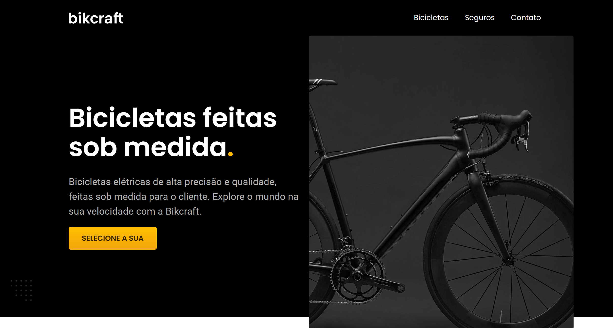
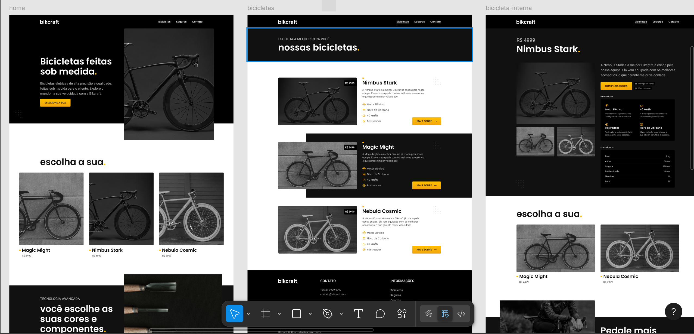

# Bikcraft - Projeto do Curso HTML e CSS para Iniciantes (Origamid)

<!--  -->

## Sobre o Projeto

**Bikcraft** é um site estático desenvolvido como projeto final do curso **[HTML e CSS para Iniciantes da Origamid](https://www.origamid.com/cursos/html-e-css-para-iniciantes/)**. 

O objetivo do projeto foi criar um site profissional para uma loja fictícia de bicicletas do zero e sem uso de frameworks e bibliotecas prontas.

O layout principal foi construido (não por mim) utilizando o figma. Entretanto, o layout para  tipos de telas menores que um desktop é diferente e não aparece no arquivo do figma. 

Você pode visualizar o site [aqui](https://caiacajr.github.io/origamid-html-css-para-iniciantes.bikcraft).

## Principal Aprendizado

- HTML e CSS.
- **CSS Flexbox** e **CSS Grid** para organização do layout.
- **Responsividade** desde o desktop até o smartphone.
- Básico de JavaScript.
- Gerenciamento de plugins externos em JavaScript. 
    *[Plugin externo usado](https://github.com/origamid/simple-anime)*
- Estrutura semântica com HTML5 para **acessibilidade** e boas práticas.
- NPM básico e Cleancss.
